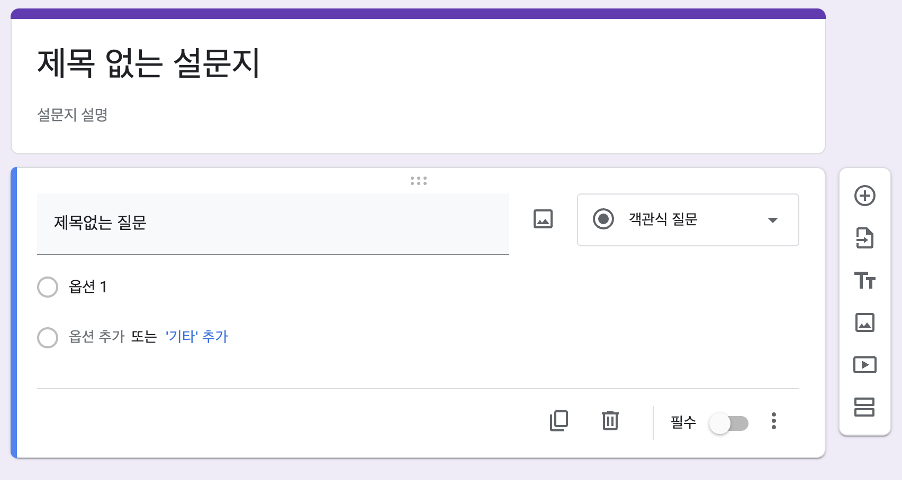

구글 설문 조사를 React로 구현하는 과제입니다.



### 기능

- 설문지 제목 추가, 편집
- 설문지 설명 추가, 편집
- 질문 추가
  - 단답형
  - 장문형
  - 객관식 질문
  - 체크박스
  - 드롭다운
- 질문 복사 기능
- 질문 삭제 기능
- 필수 옵션 설정 기능
- 미리 보기 기능
- [제출] 버튼 눌렀을 경우 사용자가 작성한 데이터를 보여주는 기능
- 질문 순서 변경 (Drag & Drop)
- 질문의 옵션 순서 변경 (Drag & Drop)

### 기술 스택

React, TypeScript, Redux, Redux-toolkit, Vite

### 실행 방법

1. 패키지 설치

```
yarn
```

2. 로컬에서 실행

```
yarn dev
```
